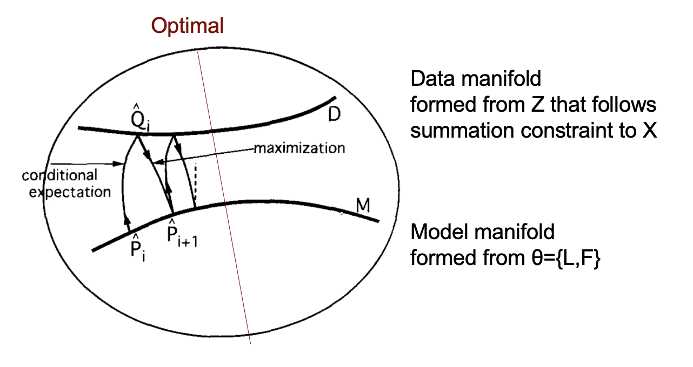

```{r setup, include=FALSE}
knitr::opts_chunk$set(echo = TRUE)
```

```{r, include=FALSE}
# install.packages("here")
library(here)
here()
```

# What is Poisson Nonnegative Matrix Factorization?

Let $X \in R_{+}^{n \times p}$ denote a matrix of observed counts $x_{ij}$. We assume $X_{ij} \sim Poi(\sum_k L_{ik}F_{jk})$.

Poisson NMF parameters include $L \in R_{+}^{n \times k}$
and $F \in R_{+}^{p \times k}$, and we seek values of L and F such that $X \approx LF^T$.


# Generating X of Interest

For this project, we are interested in a particular kind of count data $X$ such that there are K distinct hidden groups that we expect matrix factorization to reflect. Let's generate a small dataset with 3 distinct groups.

<!-- Added seed and sparse X to main experiment. -->

```{r}
set.seed(4)
source(here("docs","code","data_generate.R"))
source(here("docs","code","utils.R"))
library(pheatmap)
library(ggplot2)
library(Matrix)

# Generate synthetic L, F, X

# Define mixture weights for each L_k and F_k
# 21st mixture component (shape, rate) value is 1
l1 <- c(1, rep(0, 33)) # shape = 1e-16
l2 <- c(rep(0, 20),1, rep(0,13)) # shape = 1
l3 <- c(rep(0, 33), 1) # shape = 1000
f1 <- c(1, rep(0, 33))
f2 <- c(rep(0, 20),1, rep(0,13))
f3 <- c(rep(0, 33), 1)

# Weights will be normalized by column inside visualize_mixtures or generate_synthetic
w_matrix <- cbind(l1,l2,l3,f1,f2,f3)

visualize_mixtures(w_matrix)
# "mix", "clear membership"
data <- generate_synthetic(data_type="mix", w_matrix=w_matrix, n=12, p=30, K=3)
X = Matrix(data$X, sparse = TRUE)

# Visualize Ground Truth L, F
visualize_lf(data$L, data$F, "True")
```

# Define likelihood-related functions

## 1. Incomplete data log likelihood

<!-- Eq 11.2 in Jordan chapter -->
Incomplete data log likelihood is defined as 
$$
\ell(\theta ; x) = \log p(x|\theta) = \log \sum_z p(x, z | \theta)
$$
In this simulation case, the incomplete log likelihood is
<!-- Notice I go from x to X matrix notation 
and i didn't specify L n k matrix etc k popped up out of nowhere
ADD note explaining its a summation of of Poisson PMF (X parametrized by L, F)-->

$$
\begin{align}
\ell(L,F; X) &= \log p(X| L,F) \\
&= \sum_{i} \sum_{j}[-\lambda_{ij} + X_{ij}\log(\lambda_{ij}) - \log(X_{ij}!)]
\end{align}
$$
given that $\lambda_{ij} = \sum_k L_{ik} F_{jk}$ for simpler notation.

## Implementation: Likelihood

I moved the likelihood calculation implementation to utils.R file, but below is the commented out version of the code.

```{r}
# # Helper function
# # Take as input matrix (not sparse) LOG L, LOG F
# # Output: log lambda matrix (not sparse)
# compute_log_Lambda_mat <- function(log_L, log_F, X){
#   X_summary = summary(X)
#   i = X_summary$i
#   j = X_summary$j
#   # Create log Lambda matrix (to prevent underflow)
#   log_Lambdaval <- matrixStats::rowLogSumExps(log_L[i, , drop = FALSE] + log_F[j, , drop = FALSE])
#   log_Lambda <- sparseMatrix(i = i,
#                              j = j,
#                              x = log_Lambdaval,
#                              dims = dim(X))
#   return(log_Lambda)
# 
# }
# 
# # Assume X is a sparse matrix
# # Notice X is not in log space
# # LOG L, LOG F are also matrices
# compute_loglik <- function(log_L, log_F, X){
#   mask <- (X != 0)
#   log_Lambda = compute_log_Lambda_mat(log_L, log_F, X)
# 
#   # Compute Poisson log likelihood for all observations
#   ll = -sum(exp(log_Lambda)) +
#     sum((X * log_Lambda)) -
#     sum(lgamma(X[mask] + 1))
# 
#   return(ll)}

```


## 2. Complete data log likelihood
<!-- Eq 11.1 in Jordan chapter -->
Complete data log likelihood is defined as below. In this case, theta is L and F.
$$
l_c(\theta; x,z) \triangleq \log p (x,z | \theta)
$$

Because the following assumption defines latent variable Z, access to X, L, F determines Z, without any randomness.

$$
Z_{ijk} \sim Poi(l_{ik} f_{jk}) \\
X_{ij} = \sum_k Z_{ijk}
$$

Thus complete data likelihood is equal to incomplete data likelihood within our model formulation.

$$
\begin{align}
l(L,F; X, Z) &= \log p(X, Z| L,F) \\
&= \log [p (Z | X, L, F) \times p(X | L, F)] \\
&= \sum_{i} \sum_{j}1 * [-\lambda_{ij} + X_{ij}\log(\lambda_{ij}) - \log(X_{ij}!)]
\end{align}
$$

## 3. Auxiliary function 
Also known as the lower bound for incomplete likelihood, auxiliary function for EM algorithm is defined as

$$
\mathcal{L}(q,\theta) = \sum_z q(z|x)\log \frac{p(x,z|\theta)}{q(z|x)}
$$

## E-step
Because of the way latent variable Z was defined, we can assume a multinomial distribution modelling z given x. Therefore, (also since multinomial parameter n is fixed to X) updating $q(z|x)$ is just a matter of choosing multinomial probabilities. Also, we know that the auxiliary function is maximized when $q^{(t+1)} (z|x) = p(z| x, \theta^t)$. Therefore, the E-step is

$$
\begin{align}
q^{(t+1)}(Z|X) &= p(z| x, \theta^t) \\
&= MN(n = X, p = \frac{l_{i:}f_{j:}}{\lambda_{ij}})
\end{align}
$$


## M-step
Once $q^{(t+1)}(Z|X)$ is updated, we want 

$$
\theta^{(t+1)} = \operatorname*{argmax}_\theta \mathcal{L}(q^{(t+1)}, \theta) 
$$

<!-- Refer to 11.13 for connection with expected complete log likelihood -->

$$
\begin{align}
\operatorname*{argmax}_\theta \mathcal{L}(q^{(t+1)}, \theta) &= \operatorname*{argmax}_\theta \langle \mathcal{l}_c(\theta ; x,z) \rangle_q \\
&= \operatorname*{argmax}_\theta \sum_z q(z|x) \log p (x,z|\theta) \\
&= \sum_z q(z|x) \operatorname*{argmax}_\theta \log p (x,z|\theta) \\
&= \operatorname*{argmax}_\theta \log p(\mathbb{E}[z] | \theta)
\end{align}
$$
Note $\mathbb{E}[z]$ is given from the multinomial distribution in E-step: $\mathbb{E}[z_{ij}] = X_{ij} \frac{l_{i:}f_{j:}}{\lambda_{ij}}$.
<!-- length k vectors-->

Going back to the latent variable representation $Z_{ijk} \sim Poi(l_{ik} f_{jk})$, $\mathbb{E}[z] \sim Poi(\theta)$ thus we can write  

<!-- Log Poisson PMF for X \sim Poi(\theta) -->

$$
p(\mathbb{E}[z] | \theta) = \sum_{ijk} (\mathbb{E}[z_{ijk}]\log(l_{ik}f_{jk}) - l_{ik}f_{jk} - \log \mathbb{E}[z_{ijk}]!)
$$


Taking partial derivative of log Poisson PMF with respect to $l_{ik}$ leads to 

$$
\begin{align}
\frac{\partial \ p(\mathbb{E}[z] | \theta)}{\partial \ l_{ik}} &= \sum_j (\frac{\mathbb{E}[z_{ijk}]}{l_{ik}} - f_{jk}) \\
\Rightarrow l_{ik}^\text{(new)} &= \sum_{j} \frac{\mathbb{E}[z_{ijk}]}{f_{jk}}
\end{align}
$$

Similarly, 

$$
f_{jk}^\text{(new)} = \sum_{i} \frac{\mathbb{E}[z_{ijk}]}{l_{ik}}
$$

# Implementation: EM

```{r}
# Computes E_Z, which is a n x p x k matrix
E_step <- function(log_L, log_F, X){
  X_summary <-summary(X)
  x_val <- X_summary$x
  i <- X_summary$i
  j <- X_summary$j
  
  log_Lambda = compute_log_Lambda_mat(log_L, log_F, X)
  loglam_val <- log_Lambda@x
  
  # Compute W_ij = X_ij / Lambda_ij (Only for non-zeros)
  W_val <- exp(log(x_val) - loglam_val) 
  W <- sparseMatrix(i=i, j=j, x=W_val, dims=dim(X))
  
  # Fast sparse matrix multiplications in original space
  L <- exp(log_L)
  F <- exp(log_F)
  W_dot_F <- as.matrix(W %*% F)      # n x k
  Wt_dot_L <- as.matrix(t(W) %*% L)  # p x k
  
  # Back to log space
  logEz_sj = log_L + log(W_dot_F)  # Ez with j dimension summed, n x k
  logEz_si = log_F + log(Wt_dot_L) # Ez with i dimension summed, p x k
  
  # Return two squished slices of logEz
  return(list(logEz_sj = logEz_sj, logEz_si = logEz_si))
}

# Update log_L, log_F 
M_step <- function(log_L, log_F, E_res){
  # Prepare inputs
  logEz_sj = E_res$logEz_sj
  logEz_si = E_res$logEz_si
  
  # Update L first
  F <- exp(log_F)
  logF_sj = log(colSums(F)) # length k
  newlog_L = logEz_sj - rep(logF_sj, each = nrow(log_L))
  
  # Then update F
  L <- exp(log_L)
  logL_si = log(colSums(L)) # length k
  newlog_F = logEz_si - rep(logL_si, each = nrow(log_F))
  
  return(list(log_L=newlog_L, log_F=newlog_F))
}

```

Putting everything together,

```{r}
library(fastTopics)
source(here("docs","code","initialize.R"))
source(here("docs","code","utils.R"))

# library(NNLM)
# Another option in initialization
# init_res = NNLM::nnmf(A = as.matrix(data$X), k = 3)
# log_L = log(init_res$W)
# log_F = log(t(init_res$H))

gt_ll = compute_loglik(log(data$L), log(data$F), X)
cat("ground truth log likelihood: ",gt_ll)

# L, F initialization
init_res = initialize(X=X, K=3)
log_L = init_res$qg$qllog_norm
log_L = log_L[sample(nrow(log_L)),] # inject randomness since log_L overfit
log_F = init_res$qg$qflog_norm
init_ll = compute_loglik(log_L, log_F, X)

# Figure 1: Initialized L, F
visualize_lf(exp(log_L),
             exp(log_F),
             sprintf("Initialized Log-Likelihood: %.2f\n", init_ll))

maxiter=20
ll_list = rep(numeric(maxiter))
for (niter in 1:maxiter){
  Ez_two = E_step(log_L, log_F, X)
  
  new = M_step(log_L, log_F, Ez_two)
  log_L = new$log_L
  log_F = new$log_F

  ll = compute_loglik(log_L, log_F, X)
  ll_list[niter] = ll
  cat("niter ",niter, "-------------", sprintf("LL: %.2f\n",  ll))
}
# Figure 2: L, F after EM iterations
visualize_lf(exp(log_L), exp(log_F), "End results")

# Figure 3: Plot Log likelihood over EM iterations
y_bounds <- range(c(init_ll, ll_list, gt_ll), na.rm = TRUE)
plot(1:length(ll_list), ll_list, 
     xlim = c(0, length(ll_list)),  # Expands x-axis to include 0
     ylim = y_bounds,               # Expands y-axis to fit all values
     main = sprintf("Log Likelihood over EM Iterations\nTrue LL: %.2f", gt_ll),
     ylab = "Log-Likelihood",
     xlab = "EM Iteration",
     pch = 16)                      # Solid circle marker
points(0, init_ll, col = "red", pch = 16, cex = 1.5) # Initial LL point at x = 0
abline(h = gt_ll, col = "blue", lty = 2, lwd = 2) # True LL

```
We see EM algorithm consistently (although not across every iteration) increases in log-likelihood. Initialization is row-perturbed L and F produced from fasttopics PMF.

One thing to note is the fasttopics PMF outputs log likelihood much higher than the "ground truth," probably due to overfitting. If initialized with PMF, EM iterations marginally decrease in log likelihood over time. 

# Evaluate

Cosine similarity between vectors doesn't seem to be a good metric conveying information about the quality of estimated $l_k$, since it cannot differentiate between true $l_k$ or $f_k$ anyways. I hoped cosine similarity between true vectors would be close to zero, so that true vs. estimated vectors would give insight to the degree of different information carried by K estimated vectors.

Mean absolute error is less than one, which is not great but acceptable since it would mean EM estimated $\lambda_{ij}$ is off by less than one count from true $\lambda_{ij}$.

```{r}
source(here("docs","code","utils.R"))
source(here("docs","code","eval.R"))

mae = eval_mae(est_L=exp(log_L), est_F=exp(log_F), 
               true_L=data$L, true_F=data$F, 
               X=X)
cat("Mean absolute error: ",mae)

csim = eval_csim(est_L=exp(log_L), est_F=exp(log_F), 
                 true_L=data$L, true_F=data$F)

plot_upper_heatmap(csim$cos_L, "L Cosine Similarity")
plot_upper_heatmap(csim$cos_F, "F Cosine Similarity")

```
Code for MAE and cosine similarity calculation was moved dto eval.R, but below is the commented out version of the code.

```{r}
# Evaluate L, F using mean absolute error from
# ground truth L, F (if known from simulation)
# eval_mae <- function(est_L, est_F, true_L, true_F, X){
#   est_loglam = compute_log_Lambda_mat(log_L = log(est_L),
#                                       log_F = log(est_F),
#                                       X = X)
#   loglam = compute_log_Lambda_mat(log_L = log(true_L),
#                                   log_F = log(true_F),
#                                   X = X)
#   mae = mean(abs(exp(est_loglam) - exp(loglam)))
#   return(mae)
# }
# 
# eval_csim <- function(est_L, est_F, true_L, true_F){
# 
#   k = ncol(true_L)
#   estk = ncol(est_L)
#   col_names <- c(paste0("true_", 1:k), paste0("est_", 1:estk))
# 
#   combined_L <- cbind(true_L, est_L)
#   colnames(combined_L) <- col_names
#   cos_L <- lsa::cosine(combined_L)
# 
#   combined_F <- cbind(true_F, est_F)
#   colnames(combined_F) <- col_names
#   cos_F <- lsa::cosine(combined_F)
# 
#   return(list(cos_L = cos_L, cos_F = cos_F))
# }
# 
# # Input 1 matrix, text title
# plot_upper_heatmap <- function(sim_mat, plot_title) {
#   rows <- row(sim_mat)
#   cols <- col(sim_mat)
#   upper_tri_mask <- rows <= cols
# 
#   df <- data.frame(
#     Row = rownames(sim_mat)[rows[upper_tri_mask]],
#     Col = colnames(sim_mat)[cols[upper_tri_mask]],
#     Value = sim_mat[upper_tri_mask]
#   )
# 
#   df$Row <- factor(df$Row, levels = rev(rownames(sim_mat)))
#   df$Col <- factor(df$Col, levels = colnames(sim_mat))
# 
#   # Count how many "true" and "est" factors exist
#   num_true <- sum(grepl("^true_", colnames(sim_mat)))
#   num_est  <- sum(grepl("^est_", colnames(sim_mat)))
# 
#   # X-axis goes left-to-right. The line goes after the last "true_"
#   x_intercept <- num_true + 0.5
# 
#   # Y-axis goes bottom-to-top (because we reversed the levels).
#   # The line goes above the highest "est_"
#   y_intercept <- num_est + 0.5
# 
#   p <- ggplot(df, aes(x = Col, y = Row, fill = Value)) +
#     geom_tile(color = "white", linewidth = 0.5) +
#     scale_fill_gradient2(low = "#2166AC", high = "#B2182B", mid = "white",
#                          midpoint = 0, limit = c(0, 1),
#                          name = "Cosine\nSimilarity",
#                          na.value = "grey85") +
#     geom_text(aes(label = ifelse(is.na(Value), "NaN", sprintf("%.2f", Value))),
#               color = "black", size = 3.5) +
# 
#     # --- NEW: Draw the quadrant lines ---
#     geom_vline(xintercept = x_intercept, color = "black", linewidth = 1) +
#     geom_hline(yintercept = y_intercept, color = "black", linewidth = 1) +
# 
#     theme_minimal() +
#     theme(
#       axis.text.x = element_text(angle = 45, hjust = 1, size = 10),
#       axis.text.y = element_text(size = 10),
#       axis.title = element_blank(),
#       panel.grid = element_blank(),
#       plot.title = element_text(face = "bold", hjust = 0.5)
#     ) +
#     coord_fixed() +
#     ggtitle(plot_title)
# 
#   return(p)
# }
```

# Additional questions to explore
S. Amari, Information geometry of the EM and em algorithms for neural networks (1995) gives a geometric view of the EM algorithm. I'm interested in how the overfitted PMF solution would fit into this view.

{width=100%}

<!--
Observed data $X \in \mathbb{R}^{n \times p}$ may have intricate internal dependencies that we don't know how to model. But introducing  but assuming a latent Z exists

$\log p(x, z| \theta) $ is the complete log likelihood, can be obtained if latent Z was observed. $Z= LF^T$  in my case is the clean data where the real world data was pulled from with $X = Poi (Z)$. However, Z cannot be observed, so we are forced to work with incomplete log likelihood, equal to marginalized complete log-likelihood.
$$ 
\begin{align}
\log p(x|\theta) &= log \sum_z p(x,z | \theta) \\
&= l(\theta ; x) \text{<-  log likelihood}
\end{align}
$$

Given that Z is not observed, complete log likelihood $\log p(x, z| \theta)$ is a random quantity. To remove the randomness in complete log likelihood, we can average over z drawn from a estimated distribution $q(z|x,\theta). Then we can define the expected complete log likelihood as
$$
\langle l(\theta ; x, z) \rangle _q = \sum_z q (z | x,\theta) \log p (x,z | \theta)
$$
Note posterior probability of the latent variable z $p(z| x, \theta^{(t)})$ is the optimal $q^{(t+1)}(z|x)$ with 

Averaging over z removes stochasticity associated with z, making expected complete log likelihood no longer a random variable but a deterministic function over $\theta$. This ensures auxiliary function $L(q, \theta^{t})$ (also the lower bound on log likelihood) becomes equal to log likelihood.
-->
